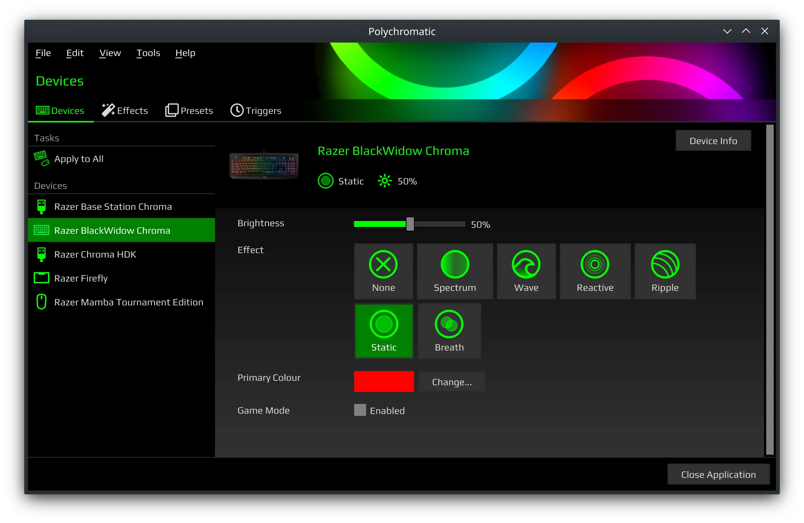

An open source RGB lighting management front-end application to customise
[OpenRazer] peripherals on GNU/Linux.

The next generation of the software (v1.0.0) - not released yet!

### [https://polychromatic.app](https://polychromatic.app)

---

## v0.3.12 Notice

This README (and branch) is for the next generation of the software still in
development. For the older release (v0.3.12) designed for Razer BlackWidow Chroma
and is compatible with most Razer hardware that was supported before 2018, see the
[stable branch](https://github.com/polychromatic/polychromatic/tree/stable-python38).

v1.0.0 is aimed to be released for beta testing as soon as humanly possible!

## About

Polychromatic is a vendor agnostic front-end for managing lighting, RGB effects
and some special functionality for keyboards, mice, keypads and just about any
other gaming peripheral on your GNU/Linux system.

The software aims to make it easy to create and co-ordinate lighting effects
that work across all compatible hardware, even if you switch to another brand
also supported by Polychromatic.

Presets and triggers enables you to switch your lighting on-the-fly
to match the application or game that's currently playing.

[View Features & Screenshots](https://polychromatic.app/about/) (v0.3.12)

## Device Support

Polychromatic on its own is just a front-end, it needs at least one backend
installed to provide the actual communication with the hardware.

**Currently, [OpenRazer](https://openrazer.github.io) is the only supported
backend at the moment.** (Being vendor agnostic is a fairly new objective!)

To check your Razer device is supported, check out the
[supported devices grid](https://openrazer.github.io/#devices) on the OpenRazer website.

In future, this project aims to add support for:

* [OpenRGB](https://gitlab.com/CalcProgrammer1/OpenRGB) - supports many brands, including GPU, MB and RAM modules.
* [Philips Hue (phue)](https://github.com/polychromatic/polychromatic/issues/296)

## Download

Instructions for each supported distro are provided on the website:

* <https://polychromatic.app/download/>

Installing packages from the repository is recommended as this will keep
the software up-to-date.

Alternately, providing all the [dependencies](https://polychromatic.app/docs/dependencies/)
are installed, you can run the application directly from the repository without
installation.

**Are you on the cutting edge?** You can grab artifacts for the [latest build from the Actions tab.](https://github.com/polychromatic/polychromatic/actions?query=workflow%3ABuild)
You'll need to be signed in to GitHub to download these. Some distros also
provide a `-git` or testing repository too.

## Something not working?

For [OpenRazer] users, occasionally, issues are caused by an improper driver
installation. Polychromatic includes a troubleshooter to identify common problems.

Should you still be stuck, [check if an issue already exists](https://github.com/openrazer/openrazer/issues),
and that your hardware is supported before [creating a new issue](https://github.com/openrazer/openrazer/issues/new).

For bugs with Polychromatic, [please raise an issue here](https://github.com/polychromatic/polychromatic/issues/new).

## Translations

The software is ready to speak multiple languages!
[Here's a guide](https://polychromatic.app/docs/translations/) if you'd like to contribute.

## Donations

If you love this software and think it's worth a few quid, euros or dollars,
you're very welcome to leave a little something to excite the developer!
Thank you for your generosity.

If you don't wish to use Ko-fi, [there's also PayPal](https://www.paypal.me/LukeHorwell).

[OpenRazer]: https://openrazer.github.io
